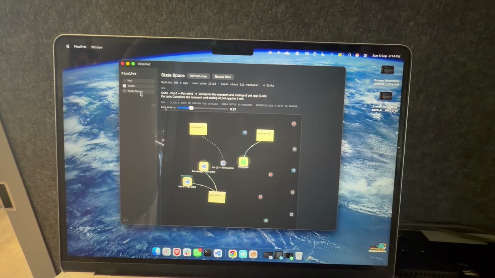

<p align="center">
  <strong style="font-size:1.6em">PixelPet</strong><br>
  A tiny pixel-art companion that lives on your Mac, walks along your windows, and knows when you're on task.
</p>

<p align="center">
  <a href="#tutorial">Tutorial</a> ·
  <a href="#features">Features</a> ·
  <a href="#install">Install</a> ·
  <a href="#branches">Branches</a> ·
  <a href="#project-layout">Layout</a> ·
  <a href="#license">License</a>
</p>

---

## Tutorial

A five-minute walkthrough of the app, from first launch to the task board and the State Space map.

<p align="center">
  <a href="https://youtu.be/VGo96MaF6w4">
    
  </a><br>
  <a href="https://youtu.be/VGo96MaF6w4">▶ Watch on YouTube</a>
</p>

## Features

**The pet**
- Five pixel pets: Dog, Cat, Perry the Platypus, Baby Dragon, and Clawd. Each is a small hand-drawn sprite with its own idle, walking, and airborne poses.
- Lives on top of everything, follows you across desktops and fullscreen apps, and walks along the top edges of your windows, climbing up their sides when a ledge is too high.
- Grab it, throw it, pet it. It bounces, gets dizzy, blinks, wags, and floats hearts when rubbed.
- Three modes: Normal, Chill (coffee on a bench), and Action (out of sight).
- Every behaviour is a setting, saved per pet: speed, gravity, bounciness, where it hangs out, how often it roams, what makes it dizzy.

**Tasks and State Space** (`main` branch)
- A board of sticky notes for today's tasks.
- Every window you use is embedded on-device and linked to the closest note, shown as a live map that updates on every focus change and every five minutes.
- Optional mirror to Actian VectorAI DB.
- The pet reads your work state from that map: it gets out of the way while you're on a task and gets restless when you drift.

## Install

Requirements: macOS 13 or later on Apple Silicon or Intel, and the Xcode Command Line Tools (`xcode-select --install`). No Xcode project, no dependencies.

```sh
git clone git@github.com:SoumilB7/Pets.git
cd Pets/mac
./install.sh          # builds PixelPet.app and copies it to /Applications
```

Open **PixelPet** from Launchpad. The pet appears at the bottom of the screen and a 🐾 item appears in the menu bar. Choose *Open PixelPet…* there for the settings window.

Useful commands inside `mac/`:

| Command | What it does |
|---|---|
| `./run.sh` | build and relaunch from `build/` (dev loop) |
| `./install.sh` | build, install to `/Applications`, launch |
| `tools/smoke.sh` | build, run the app for a while, assert on its log |
| `python3 tools/preview.py Dog --all` | preview a pet's frames in the terminal |
| `tools/make-signing-cert.sh` | one-time local signing certificate so macOS keeps permissions across rebuilds |

Window titles and page URLs need Accessibility access; the app asks once. Everything stays on the Mac.

## Branches

| Branch | What's on it |
|---|---|
| `main` | The full app: pets, task board, State Space, work-state awareness. |
| `pets-only` | Just the pets and their settings. Same engine, none of the task or context machinery. |

## Project layout

```
mac/                 the macOS app (Swift / AppKit, built with swiftc)
  Design/            pixel art: one file per pet, shared effects, the sprite contract
  Engine/            behaviour, physics, rendering, settings, the app window
  tools/             preview, icon, signing, smoke test
  ARCHITECTURE.md    file-by-file map and data flow
  DESIGN_BRIEF.md    instructions for anyone drawing new pets
docs/media/          poster frame for the tutorial (video is on YouTube)
App.tsx, components/ an early React Native prototype of the pet for phones
```

Pixel art and behaviour are deliberately separate: pets are plain strings of characters in `mac/Design/Pets/`, validated at launch, so a new pet is one file and one line in the registry.

## License

MIT. See [LICENSE](LICENSE).
